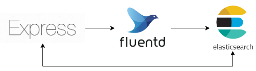

# express-fluentd


## description
This repository is a sample docker environment of fluentd, express, elasticsearch.
I assume production environment install express as main container, and fluentd as [side-car container](https://learn.microsoft.com/ja-jp/azure/architecture/patterns/sidecar).

## usage

1. run this repo locally.
```bash
$ make init
```

2. access to http://localhost:3000, show the following page.
<table border="1">
          <tbody><tr>
            <th>ip</th>
            <th>ua</th>
            <th>timestamp</th>
          </tr>
      <tr>
        <td>::ffff:xxx.xx.x.x</td>
        <td>Mozilla/5.0 (Macintosh; Intel Mac OS X 10_15_7) AppleWebKit/537.36 (KHTML, like Gecko) Chrome/113.0.0.0 Safari/537.36</td>
        <td>yyyy/MM/dd HH:mm:ss</td>
      </tr>
        </tbody></table>